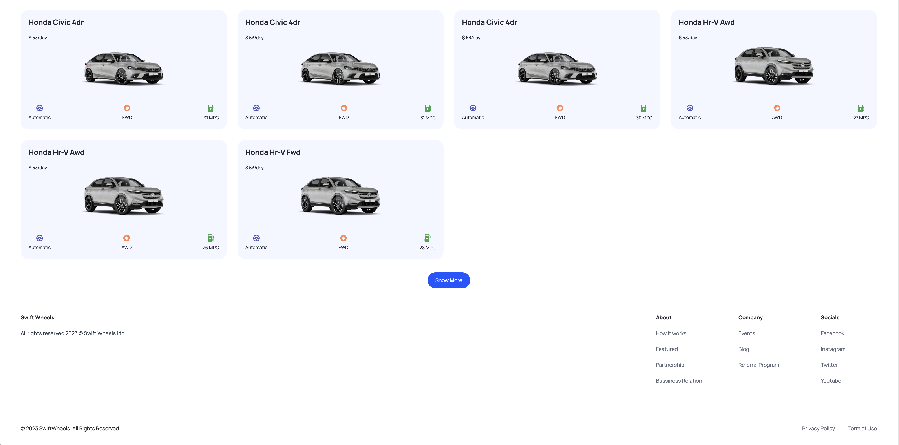
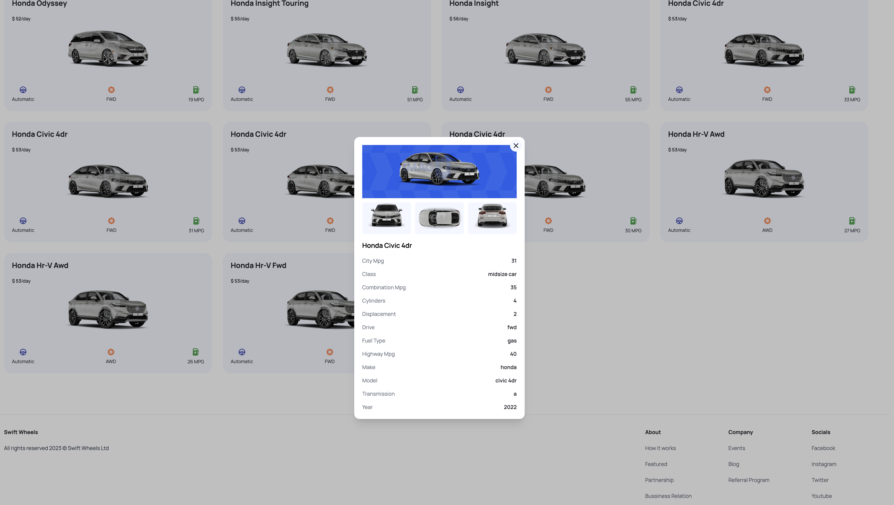

# Swift Wheel

## Introduction
Welcome to Swift Wheel, the one-stop website for all your car rental needs. Our platform offers a convenient and user-friendly service, enabling you to access a range of rental car services with ease. Swift Wheel simplifies your travel by providing a seamless rental experience.

## Features
- **Seamless Car Rentals**: A streamlined process to browse, compare, and rent cars.
- **User-Friendly Design**: An intuitive website design for a hassle-free user experience.
- **Diverse Fleet**: Access to a variety of cars to suit any requirement or preference.
- **Instant Booking**: Quick and easy car booking with instant confirmation.

## Technical Stack
The Swift Wheel site is crafted using state-of-the-art web development tools and technologies:
- **Frontend**: Next.js 13, React, Typescript
- **Styling**: Tailwind CSS for stylish and responsive layouts

## External API
Swift Wheel utilizes the [Cars by API Ninjas](https://rapidapi.com/apininjas/api/cars-by-api-ninjas/) to fetch an extensive and detailed list of cars available for rental. This integration provides users with up-to-date information and a broad selection of vehicles, ensuring a comprehensive and convenient car rental experience.

## Getting Started
Here's how you can run Swift Wheel on your local machine:
1. Clone the repository to your machine.
2. Navigate to the project directory.
3. Install dependencies using `npm install`.
4. Start the development server with `npm run dev`.
5. Visit [http://localhost:3000](http://localhost:3000) in your browser to explore the site.

## Acknowledgments
- A special thank you to [API Ninjas](https://api-ninjas.com) for providing the car data API used in this demo site.

## Screenshots & Demo
Here's a glimpse of the Swift Wheel platform:

